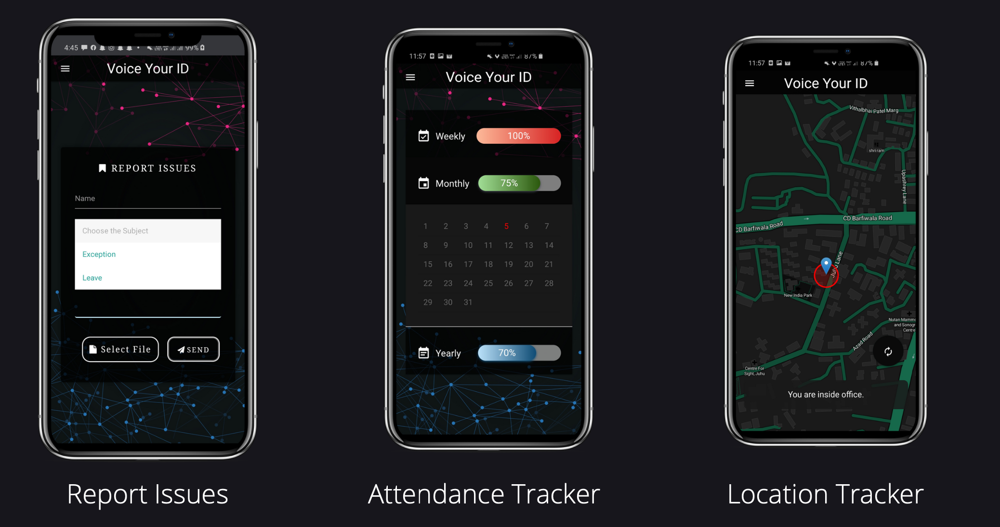

# VoiceYourID 

## Speaker Dependent Voice Recognition based attendance management system 

Application Prototype Deployed at: https://www.voiceyourid.web.app

## 🎯 Problem Statement

This project is a solution to the problem statement posted by the Ministry of Youth Affairs and Sports and Nehru Yuva Kendra Seva Sangathan (https://nyks.nic.in/) during the Smart India Hackathon 2020.

- NYKS has 623 district offices and 29 state offices across the country.

- NYKS needs software by which NYKS may take the attendance of the officers working in these districts and States.

- The Mobile should collect the attendance based on the location of the officer through GPS system / Geo-Location System and voice recognition or landline telephone number and voice recognition.

## 🏆 Achievements

This project won the first prize in Smart India Hackathon 2020 among 80+ teams selected from Engineering colleges throughout India that were working on the same problem statement.

## 🚀 Our Approach

- Initially, this problem statement was given by NYKS. It stated to build an attendance management system for 623 district offices and 29 state offices across the country.

- Further exploring the attendance management could be more robust in areas like malls, stadiums, and amusement parks.

- The aim is to remove the traditional approach of marking attendance on a register or a biometric stationed device.

- Our product will remove the long waiting time in a queue and can be implemented from a small scale to a large multinational company.

- We plan to redesign the traditional attendance marking system by using cutting-edge technologies for robust, fast, and simple attendance marking.

- Our solution uses geofencing for verifying the user's location, GMM based voice authentication, and MongoDB cloud for hierarchical database. Other forms of biometric systems can also be implemented based on customer needs.

- Users simply need to enter the office premises, open the web app, say the phrase to mark their attendance.

- We can also provide different kinds of attendance services based on customer needs.

## 💡 Unique Selling Point/ Innovation

- Our solution provides an alternate IVR for voice authentication. If in any unforeseen condition where the user cannot mark his/her attendance using the web app, he/she can simply use the office landline, say the phrase, and walk with attendance marked.

- Additionally, we use speaker-dependent voice recognition, since no two people can have the same vocal characteristics any kind of malpractice is impossible.

- We extract 48 different features which include pitch, frequency using MFCC (Mel Frequency Cepstral Coefficient). Also providing accurate noise filtering, our models can perform well in all scenarios.

- In the case of geofencing, our system also blocks location mocking. We also provide a hierarchical structure of the system based on the requirements of the customer.

## 📊 Use Case Diagram

## 💼 Business Potential

- VoiceYourID (VOID) will revolutionize the current attendance marking system. It will completely replace the long queues at biometric scanners in almost all offices.

- The unique IVR provides an excellent alternative making our system robust and production-ready.

- VOID provides complete end-to-end attendance manager, i.e., it includes an admin portal for a complete overview of data visualized in graphs, charts, etc.

- The ease, speed, and accuracy provide an excellent choice over all other alternatives especially in the current COVID situation where maintaining social distancing is key. VOID eliminates any kind of contact making it THE PERFECT CHOICE.

## 📈 Market Potential

- Since it is a flexible service it has huge potential to be implemented in almost all the sectors of the market.

- It can be used to track the attendance in a stadium, mall, amusement parks, and all the public areas where a ticket is required.

- Since there is no additional hardware required our system can be integrated with any smartphone and hence the cost of implementing is also minimal.

- For areas like offices, our system can provide high security through voice & biometric authentication and hence can be used there as well.

## 🛑 Constraints

- People who don't use smartphones won't be able to avail these services.
- Since we are relying on smartphones for input, any damage to the biometric sensors can affect the system's efficiency.
- Constraints like speech impairment and room lighting conditions can affect the biometric recognizer.

## 🛠️ Technology Stack

### Frontend
- Progressive Web App Design: React.js, HTML5, Bootstrap
- User Account Authentication: Firebase Authentication
- Web App hosting(Client Side): Firebase Hosting
- Voice Recording: W3C’s Media Recorder API (Open Source)
- Geolocation: W3C’s Geolocation API (Open Source)

### Backend
- ML Scripting Language: Python 3
- Feature Extraction: MFCC (Mel Frequency Cepstral Coefficients)
- ML Model: GMM (Gaussian Mixture Models)
- Classifier: Expectation Maximization Algorithm

### REST API
- Server Side Scripting: Node.js
- Hosting: AWS EC2 Instance
- Storage: AWS EBS( Elastic Block Storage)
- HTTPS SSL Certificate: Let’s Encrypt

### Telephone Voice Recognition: IVR
- Computer Telephone Integration (CTI): Twilio Cloud Services
- Server Side Phone Routing: Python-Flask Server

# 🖥️ Front End Progressive Web Application

## 🖥️ Admin Portal ( Management )

